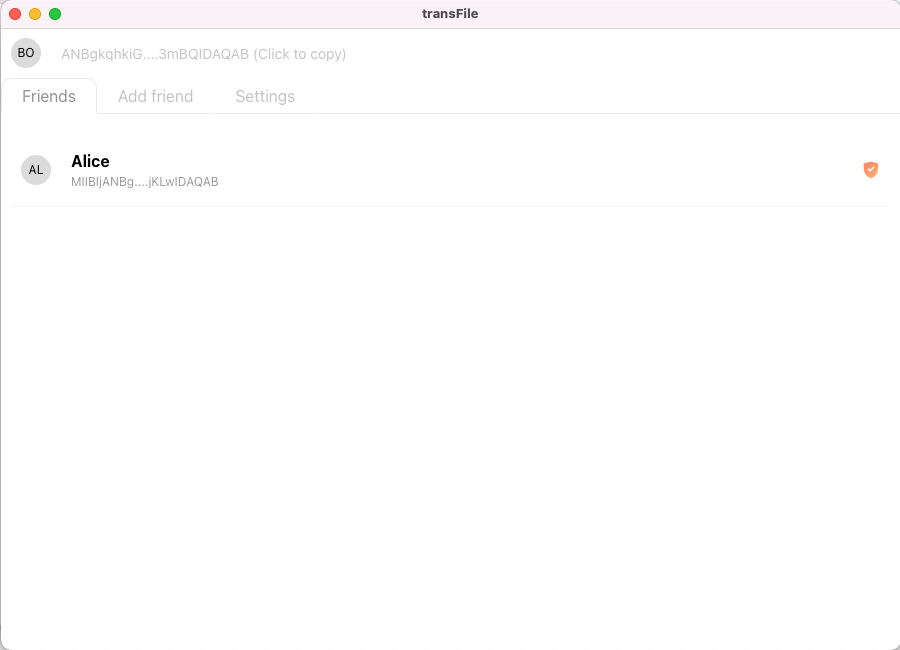

<p align="center">
  
</p>

<h1 align="center">FileTransfer — Simple Cross-Platform LAN File Sharing App</h1>

<p align="center">
  Fast, secure, and private file transfer — right from your desktop.
</p>

[](https://www.electronjs.org/)

[](./LICENSE)
[]()

A fast, minimal, and **secure** file transfer desktop app built with **Electron**.
Send and receive files between devices over local networks with ease.

---

## ⬇️ Download

Get the latest release of **FileTransfer** for your OS:

> ⚠️ Available soon.

- **Windows:** [Download EXE](#)
- **macOS:** [Download DMG](#)

---

### 📝 Motivation

In my work environment, sharing files was often slow and cumbersome — USB drives, email attachments and shared folders were inefficient, especially across different operating systems.

I wanted a **fast, private, and simple way to share files with just one person**, even over potentially unsecure networks.

This frustration inspired **FileTransfer**, a lightweight app for **secure peer-to-peer file transfer** on local networks.

## 📖 Table of Contents

- [Features](#-features)
- [Screenshots](#-screenshots)
- [Tech Stack](#-tech-stack)
- [Security Overview](#-security-overview)
- [Contributing](#-contributing)
- [Documentation](#-documentation)

  - [Installation](#️-installation)
  - [Running 2 Instances on Localhost](#running-2-instances-on-localhost-for-testing)
  - [UDP Friend Discovery](#udp-friend-discovery)
  - [KEK AES Key Exchange](#kek-aes-key-exchange)

---

## ✨ Features

- ⚡ **Fast Transfer** – optimized peer-to-peer data exchange
- 🔐 **Secure** – RSA encrypted connections between devices
- 🖥️ **Cross-platform** – works on Windows, macOS, and Linux
- 📁 **Drag & Drop Support** – just drag files to send
- 🌐 **LAN Discovery** – simply add friends on LAN

---

## 🧩 Screenshots

| Add Friend                                      | Friend List                                        | Accept File                                       |
| ----------------------------------------------- | -------------------------------------------------- | ------------------------------------------------- |
|  |  |  |

## 🧠 Tech Stack

- [Electron](https://www.electronjs.org/) — cross-platform desktop framework
- [Vue.js](https://vuejs.org/) — modern reactive UI

---

## 🔐 Security Overview

FileTransfer ensures that all data is transmitted securely between devices using a hybrid encryption scheme.

### Key Features

- **Asymmetric Encryption (Public Key Cryptography)**
  Each device generates a public/private key pair.
  The public key is shared with other devices, while the private key never leaves the local machine.

- **Key Encryption Key (KEK)**
  A KEK is used to encrypt the actual session key exchanged between peers.

- **Session Keys**
  For each transfer, a unique symmetric key is generated to encrypt the file data itself.
  After the transfer is complete, the session key is destroyed.

- **End-to-End Encryption**
  Only the sender and receiver can decrypt the transmitted file — no third party or relay server can read the data.

---

## 🤝 Contributing

Contributions, bug reports, and suggestions are welcome!
If you'd like to add features or fix issues, please open a Pull Request.

```bash
git checkout -b feature/your-feature
git commit -m "Add: new feature"
git push origin feature/your-feature
```

---

## 📘 Documentation

## 🧭 Project Structure & Entry Points

| File / Directory                      | Description                                                                                        |
| ------------------------------------- | -------------------------------------------------------------------------------------------------- |
| `electron/main.js`                    | Main Electron entry point — creates the app window and initializes communication and dependencies. |
| `electron/preload/preload.js`         | Exposes secure APIs to the renderer (Vue).                                                         |
| `electron/preload/passwordPreload.js` | Preload for the password entry window.                                                             |
| `electron/main/ipcs/index.js`         | Centralized IPC handlers for communication between main and renderer processes.                    |
| `vue/main.js`                         | Entry point for the Vue UI.                                                                        |

## 🔌 IPCs (Inter-Process Communication)

All Electron IPC communication is centralized in `electron/ipcs/index.js`.  
It contains the main channels for sending and receiving messages between the main process and Vue renderer processes, including:

- File transfer commands
- Encryption key exchange
- Status updates for UI
- Password validation events

Files are inside `electron/main/ipcs/`

| File / Directory           | Description                                                        |
| -------------------------- | ------------------------------------------------------------------ |
| `electron/addFriend.js`    | Handles friend discovery and peer connection setup.                |
| `electron/fileTransfer.js` | Manages file transfer requests and progress updates.               |
| `electron/app.js`          | Handles general app operations (copy/paste, file selection, etc.). |

## 🗂️ Backend Modules

| File / Directory              | Description                                                                                                                                          |
| ----------------------------- | ---------------------------------------------------------------------------------------------------------------------------------------------------- |
| `electron/cryptoUtils.js`     | Provides cryptographic utilities including RSA encryption/decryption, AES encryption/decryption with HMAC, and object/buffer conversions.            |
| `electron/friendsManager.js`  | Manages friends list: adding/removing friends, storing metadata, handling AES handshake state, and persisting encrypted friend data to disk.         |
| `electron/keyManager.js`      | Handles RSA key pair generation, passphrase validation, symmetric key generation, and key encryption/decryption utilities.                           |
| `electron/settingsManager.js` | Manages user settings (like download path) with AES-encrypted persistence and simple getters/setters.                                                |
| `electron/tcpServer.js`       | Implements TCP servers for RSA and AES encrypted communication with friends, including session management, handshake, and JSON stream handling.      |
| `electron/udpServer.js`       | Provides an event-driven UDP server for sending and receiving JSON messages, with automatic event emission based on message type. (Friend discovery) |

[](https://editor.plantuml.com/uml/NPB1JiCm38RlUGfh5-0m-WPeecFI19KgnhW0XoWrLMYRHaawKI7U7Njjgh2R_UVx_oPsDpv85uQk5RxHnaedEr1zPtk39Xp2s28uL46QkaKXh5IDh15M3os9hZTGI6sWTBr2xrVm8m3UzcKEJt94zswkSUOoRPNFjAdm-_RBtto0z42S-4qoxwb0Kq7HLqEBCIrtemqz78DkTT3eALIT9LRy4ZPXR7Z4aMvbA98lqE0uDmjAG54xHdTEqmTzWdzEogLb1jbpm12qgLEJdwLBLqJPzfANrBlJsH2KdUe5fMEcZjk46gfBYex_JUnrG7YcYw53Du-BfJpkpqC6npr5dGRCEjhKaaGO9rt15Yq764MZ5MnUh-_Ec-4jSiqtYpL_FzPn9B5V7YlugIaH-tb5_CRqMCGj9CoqebHPnfveOaC-_dN_0000)

> Class instances are intentionally omitted for clarity. This diagram focuses on the static structure of modules and their dependencies.

## Development running

### 🛠️ Installation

```bash
git clone https://github.com/maj-devs/fileTransfer.git
cd fileTransfer
npm install
```

---

### Running 2 Instances on Localhost (for testing)

Instance A:

```bash
TCP_PORT=41237 UDP_PORT=41200 UDP_PORT2=41202 INSTANCE=1 npm run dev
```

Instance B:

```bash
TCP_PORT=41235 UDP_PORT2=41200 UDP_PORT=41202 INSTANCE=2 npm run dev
```

---

### Building app

```bash
npm run build
```

## Protocols

### UDP Friend Discovery

[](https://editor.plantuml.com/uml/RP9DQm8n48Rl-HK3lIXK-Y48YeY97nU5BgtU2XApinhKoJQ9hLBwtxk9YylMlhaayqwUOIOPEY-jFnxsp6k_HrYE4vXQZPJ2M3jbFj6U6NCxJRcqyW0EFuv82k6RGI5khVaQcRsnSDTkTpfANSBA6okCJT5UpQ3Ad1hojzPSPpZNXBMhtQYwBzLkOysHqZ8dwuOLSvAY7wrqBidNC9secvI_98ogcbjijTeHEWVFCIZCAP5fgca3Ju_iXp4cGp_bq5OSf0DUZuaG4unnQ0r0G2yCkGVzzI2BlclPC5JdMveoqtzO3w0XNb_uUCJV5irtQbpIPdXUyVlY0QZegJnubIV6-h0bUS0LRp8cGXN-RnMN6qglLGfo1HCLJ9Gm4M7zahOONMYpoGoA2p0vgQsa3GOIOyC253xHBm00)

### KEK AES Key Exchange

[](https://editor.plantuml.com/uml/XLDHQzim47xNhpZOIml9kYHhM4emaJjtXOGHsZwqC0YAV8w57ScJvApPs7_loIrDdTBaz2BkJf--k-zkuhomlbwNp2jV8eoNqTYfltZH-nPDaodmv1Qck8NaKUP2hn2kXKvTBWeSduMyQ7osZ1XpXTALi68D3d_Ng2N2FmPat5hpvzAKniAdmM0ubFBPBRsniR4fsjTWi5tmocZ_FZHJ6SwKnjRJKMFjk935offQfoyvsIYS9cTE1IkfAg5z2sROsBkKVIHiR5VSNQvaeT4vw3VEs3pEHPeglOBU5_QVCH7AWIkhKASB3i81R_lYu8iPOnow4SHm4LIWvdUdoKCtkR-yvZz_9DrUwFGldMXfjvL7UhQOryjIIPBdX6HQ5BZj0AbKbaX2zKuPYmCU_m2llu_7t-3jODv0za-FK1mSejY2ESZiwo5cDA--TekRX7z_ECRd_12VFI1jF8BPe0NU8J5uvkdgF5Pmte6byJbKYDP1BZO8bAOoXUckDmveBuAiQYFe9_0vDhlZQ32KqK3YG4QIEvIrHP1clQwrai9Jy3EZAO10WB49NMaRdm00)
